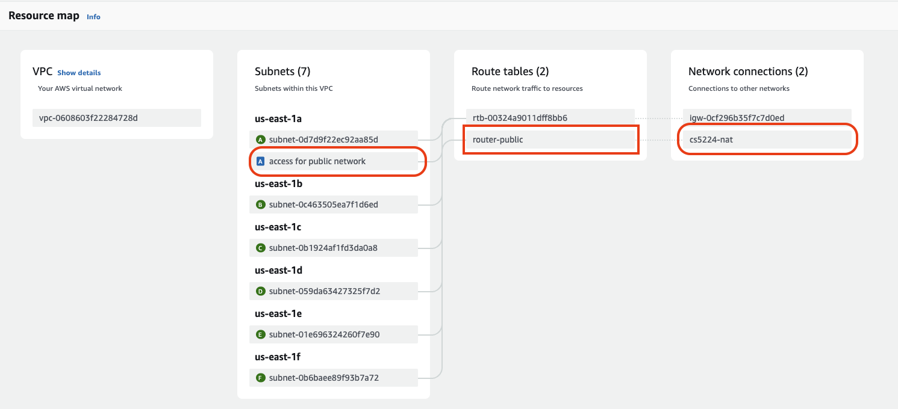

## Film Radar(FM) - Discover Your Personal Taste
Film Radar is our group project, an innovative Film Recommendation Software as a Service(SaaS) that
leverages advanced algorithms and user preferences to deliver personalized movie tastes.
In a time of plentiful entertainment options, our SaaS aims to simplify the movie selection
process, enhance user satisfaction, and drive engagement by offering tailored recommendations
that match individual tasted and preferences.

## Roadmap of Contents
- [Overview](#overview)
- [UI Service](#ui-service)
  - [UI Development](#ui-development)
  - [UI Deploy](#ui-deploy)
- [User Service](#user-service)
  - [User Service AWS Cognito Development](#user-service-aws-cognito-development)
  - [User Service AWS DynamoDB Development](#user-service-aws-dynamodb-development)
  - [User Service AWS EC2 Instance Development](#user-service-aws-ec2-instance-development)
- [Recommendation Service](#recommendation-service)
  - [Recommendation Service AWS EC2 Instance Development](#recommendation-service-aws-ec2-instance-development)
- [Movie Service](#movie-service)
  - [Movie Database](#movie-database)
  - [Movie Server](#movie-server)
  - [Movie Timer](#movie-timer)
  - [VPC Configuration](#vpc-configuration)

### Overview


### UI Service
The codes of UI service can be divided by two parts: React App Development and host server.

#### UI Development
To launch React App Development, make sure you have installed nodejs in your machine, then run:
```
cd esrs_ui
npm install
npm start
```
You would see a local server launched in local and listened to port 3000.

#### UI Deploy
First, build your UI by running:
```
cd esrs_ui
npm run build
```
Then there will be a folder called `build` generated. Move this folder to UI host server:
```
mv ./esrs_ui/build ./ui_host_server/static
```
After that, run:
```
cd ui_host_server
pip install -r requirements.txt
python app.py
```
The UI Service will be running on port 8081

### User Service
The implementation of user service consists of api handlers, client layers and dao layers.
The service replies on two additional AWS services: AWS Cognito and AWS DynamoDB.

#### User Service AWS Cognito Development
Heading to AWS Cognito page and create new user pool, select `User name` and `email` as sign-in options


Choose `NO MFA`


Choose `Send email with Cognito`


Once user pool is created, clicks the newly created user pool and select App integration. Copy the Client ID and paste the value in the `conf/conf.yml file`


#### User Service AWS DynamoDB Development
Enter the table name and use `user_id` as the partition key.


#### User Service AWS EC2 Instance Development
We could utilize Elastic Beanstalk to deploy the user service. Execute commands
```
cd user_server
zip -r user.zip *
```
There will be a zipped file named as user.zip


Select golang as the platform, upload the zipped file as the application code


Make sure Public IP address is activated.

Once the Elastic Beanstalk environment is created, check if the corresponding EC2 instance is initiated successfully.

### Recommendation Service
The implementation of recommendation service consists of api handlers, user/movie clients and recommendation algorithm.

#### Recommendation Service AWS EC2 Instance Development
Similar to User service and Movie Service, we also use Elastic Beanstalk to deploy the recommendation service. Execute commands
```
cd recommendation_server
GOOS=linux GOARCH=amd64 go build -o application
zip recommend.zip application Procfile
```
There will be a zipped file named as recommend.zip, the rest of steps are the same as the other two services above.

### Movie Service
This module comprises movie server, movie timer, movie database and a NAT gateway for accessing the public networks.

#### Movie Database
Due to the model entity of movies, we select relational database and use `MYSQL` as engine.

RDS is a PaaS that AWS provides developers with features to maintain databases, table, index and data.
Here are reasons why we select `RDS` instead of serverless `Dynamo DB`
1. Movie Service has to sort by `popularity` and  `rate` and retrieve data in pages, `sql` can support this functionality natural.
If we use `NOSQL`, such as `Dynamo DB`, `Redis`, we have to store redundant data to support complex queries in multiple dimensions.
2. Based on requirements, our SaaS is capable to fuzzy search movie by `title`. `Nosql` cannot support string prefix matching.


There are two things that need to care:
1. `Activiate Public IP`: The first one is that we have to activate `the public ip` so that our localhost can connect with mysql.
2. `Configuration of Secruity Group`: The secruity group of this RDS have to allow inbound traffic in 3306 port which is a protocol of MYSQL.

### Movie Server
Movie server is just an API service, we just follow the guideline of Elastic Beanstalk to name the document as `application.go`.
Then, Elastic Beanstalk will execute its script to `go build -o application.go` to output binary files and boostrap the server.
This process is similar with the deployment stage in User Module and Recommendation Module.

### Movie Timer
Movie Timer is used to update and retrieve newly released movies from our partnership `TMDB`, a public well-known movie database, through their open API.
We create a `Event Bridge` and `Lambda` to schedule this task every night.

#### EventBridge

We link this event bridge with lambda function `movie_timer`.   


We express our schedule strategy in cron expression, which means that this task will run in 0 o'clock every day until May 31st.

#### Lambda Function


This is the configuration of our lambda function.   
With the use of AWS lambda SDK, we program a timer which asynchronously refresh movie data.   
Because my laptop is Mac M2, an ARM architecture, we have to use the following command to compile our lambda program.
```command
GOOS=linux GOARCH=arm64 go build -tags lambda.norpc -o bootstrap main.go
```
Then, we pack the executable binary file, `bootstrap` into a zip file and upload to lambda.

### VPC Configuration
However, when we were testing this timer module, we found a problem that our program cannot access TMDB through HTTPS.   
After trying and analyse the problem, we notice that private resources have to rely on NAT to transform the private IP into the public one for public network access.   
Therefore, we have to build a NAT gateway in `public subnet` and config a route in the router of private subnet to access this gateway. As a result, our private resource, `lambda` can access the external API beyond AWS.

Here is the network configuration of our VPC:

First, we establish a new private network which is used for hosting our lambda function. Because lambda function is hosted by AWS, it has no fixed public IP so that it cannot communicate like Elastic Beanstalk.

Then, we create a router in this private subnet and add a route to the NAT.


Here, we transform the private IP in this subnet to the private IP of NAT in this VPC.   
This private subnet is to host our lambda resources. If we can have public IP like EC2 or Elastic Beanstalk, we just deploy this resource in the public subnet which have an Internet Gateway.

Here is our configuration of NAT

This NAT has to be deployed in the public subnet so that it can access to the public network. This highlighted subnet is a public network with the route to Internet Gateway.

In summary, the private follow the below process to the public networks:
1. Private IP --> router in this private subnet --> Private IP of NAT gateway
2. Private IP of NAT gateway -> Public IP of NAT gateway
2. Public IP of NAT gateway -> Target Public IP
