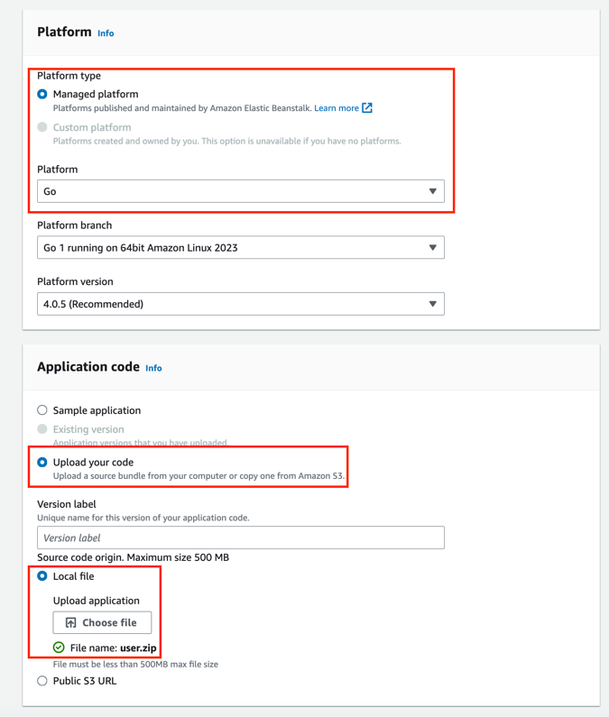

## Film Radar(FM) - Discover Your Personal Taste
Film Radar is our group project, an innovative Film Recommendation Software as a Service(SaaS) that
leverages advanced algorithms and user preferences to deliver personalized movie tastes.
In a time of plentiful entertainment options, our SaaS aims to simplify the movie selection
process, enhance user satisfaction, and drive engagement by offering tailored recommendations
that match individual tasted and preferences.

## Table of Contents
- [Overview](#overview)
- [UI Service](#ui-service)
  - [UI Development](#ui-development)
  - [UI Deploy](#ui-deploy)
- [User Service](#user-service)
  - [User Service AWS Cognito Development](#user-service-aws-cognito-development)
  - [User Service AWS DynamoDB Development](#user-service-aws-dynamodb-development)
  - [User Service AWS EC2 Instance Development](#user-service-aws-ec2-instance-development)
- [Recommendation Service](#recommendation-service)
  - [Recommendation Service AWS EC2 Instance Development](#recommendation-service-aws-ec2-instance-development)

### Overview


### UI Service
The codes of UI service can be divided by two parts: React App Development and host server.

#### UI Development
To launch React App Development, make sure you have installed nodejs in your machine, then run:
```
cd esrs_ui
npm install
npm start
```
You would see a local server launched in local and listened to port 3000.

#### UI Deploy
First, build your UI by running:
```
cd esrs_ui
npm run build
```
Then there will be a folder called `build` generated. Move this folder to UI host server:
```
mv ./esrs_ui/build ./ui_host_server/static
```
After that, run:
```
cd ui_host_server
pip install -r requirements.txt
python app.py
```
The UI Service will be running on port 8081

### User Service
The implementation of user service consists of api handlers, client layers and dao layers.
The service replies on two additional AWS services: AWS Cognito and AWS DynamoDB.

#### User Service AWS Cognito Development
Heading to AWS Cognito page and create new user pool, select `User name` and `email` as sign-in options


Choose `NO MFA`


Choose `Send email with Cognito`


Once user pool is created, clicks the newly created user pool and select App integration. Copy the Client ID and paste the value in the `conf/conf.yml file`


#### User Service AWS DynamoDB Development
Enter the table name and use `user_id` as the partition key.


#### User Service AWS EC2 Instance Development
We could utilize Elastic Beanstalk to deploy the user service. Execute commands
```
cd user_server
zip -r user.zip *
```
There will be a zipped file named as user.zip



Select golang as the platform, upload the zipped file as the application code


Make sure Public IP address is activated.

Once the Elastic Beanstalk environment is created, check if the corresponding EC2 instance is initiated successfully.

### Recommendation Service
The implementation of recommendation service consists of api handlers, user/movie clients and recommendation algorithm.

#### Recommendation Service AWS EC2 Instance Development
Similar to User service and Movie Service, we also use Elastic Beanstalk to deploy the recommendation service. Execute commands
```
cd recommendation_server
GOOS=linux GOARCH=amd64 go build -o application
zip recommend.zip application Procfile
```
There will be a zipped file named as recommend.zip, the rest of steps are the same as the other two services above.
